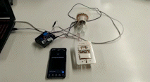
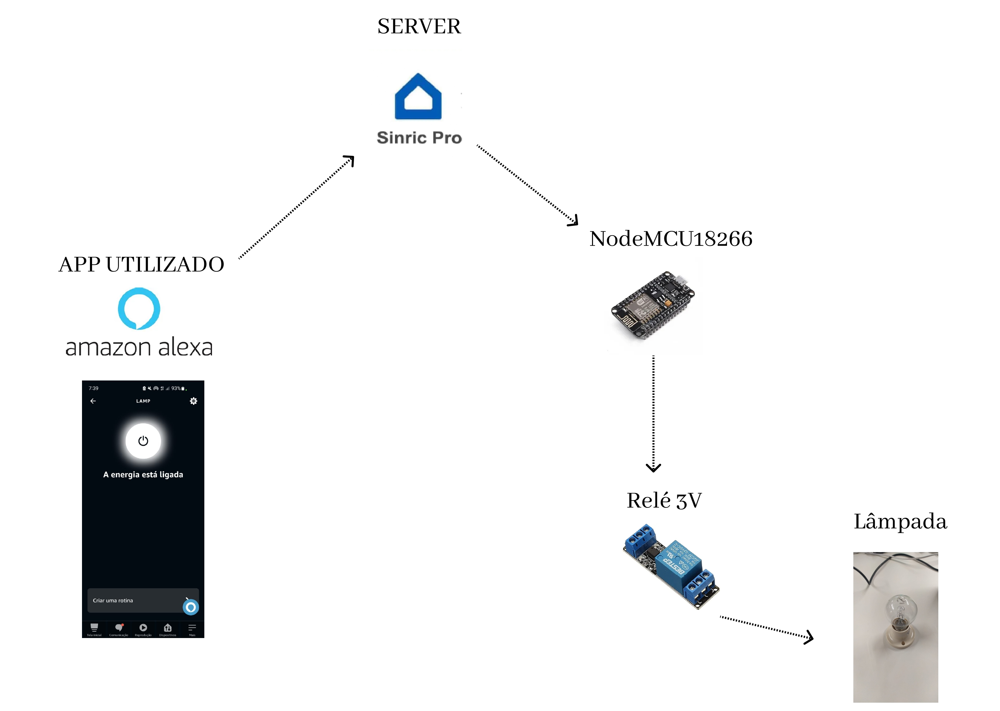
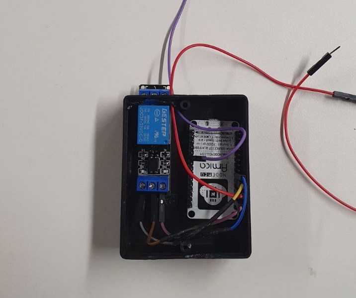
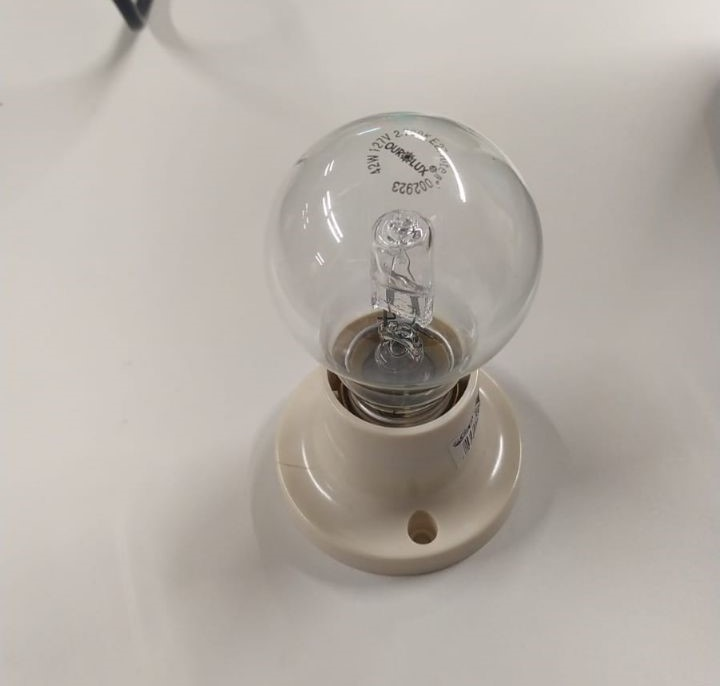
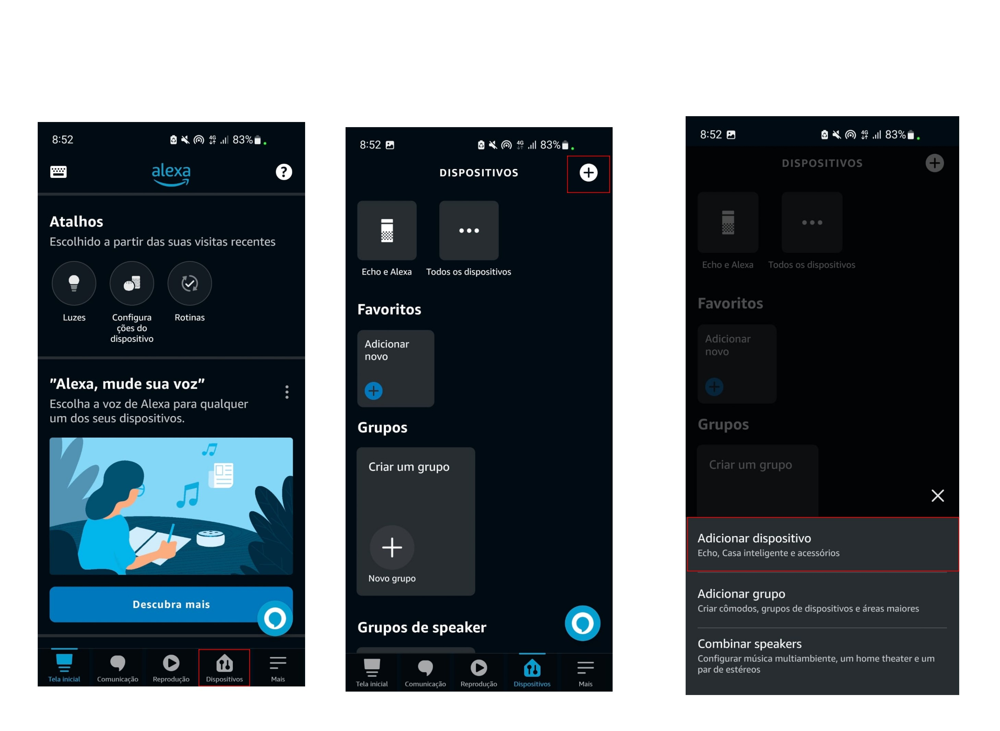
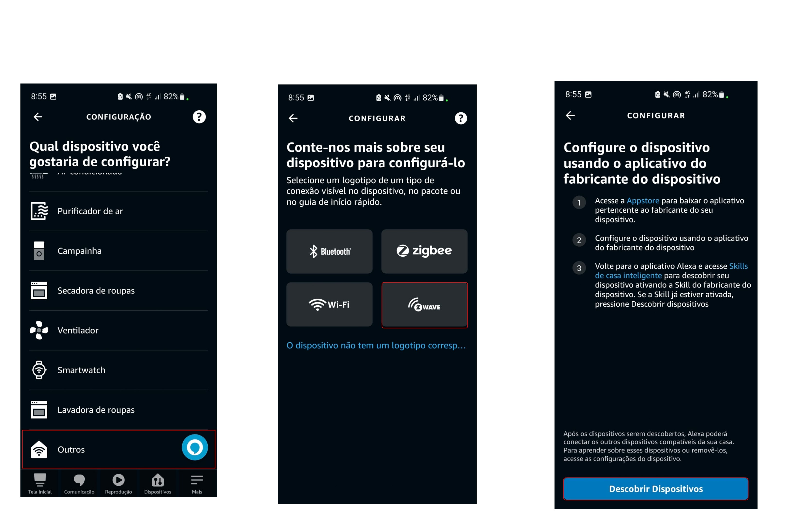
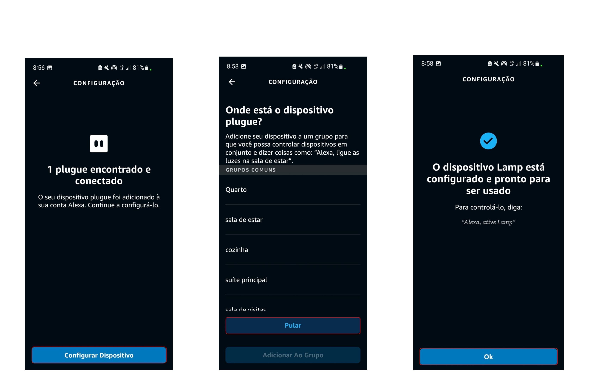

<h1 align="center"> Projeto Integrador MVP - Lummu </h1>


<p align="center">

</p>

<h1 align="center"> :bulb: Estrutura do Projeto :bulb: </h1>

<p align="center">

</p>


> - Foi Adaptado um interruptor interno; 
> - Adicionado um NODEMCU com relé para ativação e desativação da corrente elétrica da lâmpada onde assim faz com que ligue e desligue;
> - Todos os componentes ( Relé, Node MCU e bateria) estão armazenados numa case ligado a corrente elétrica;
> - Utilizado um Relé de 3V onde fica armazendo no case.

<p align="center">

</p>
<p align="center">

</p>

<h1 align="center"> :computer: Programação :computer: </h1>

<p align="center">


</p>

[Sinric Pro](https://portal.sinric.pro/register), acesse e crie sua conta, crie um novo dispositivo, pegue as credências e defina as seguintes variáveis.


```js
#define APP_KEY           "c9a60600-af2c-4a5e-8936-cc619e93d12a" 
#define APP_SECRET        "e6979de6-9e34-43e5-8759-2df0ec17f5c2-da731060-ad89-4851-9303-1322fe232cfa"
#define SWITCH_ID         "6349f0a416440f13ff7d2836"
```
Configure sua rede Wi-Fi

```js
#define WIFI_SSID         "S10e"  - NOME DA REDE  
#define WIFI_PASS         "eotamisgod" -  SENHA DA REDE
```

Baixa o app da Alexa e adicione o dispositivo.





# Contribua 

1 - Fork it

2 - Cria sua feature branch (git checkout -b my-new-feature)

3 - Commit suas mudanças (git commit -am "Added some feature")

4 - Push na sua branch (git push origin my-new-feature)

5 - Crie novo Pull Request